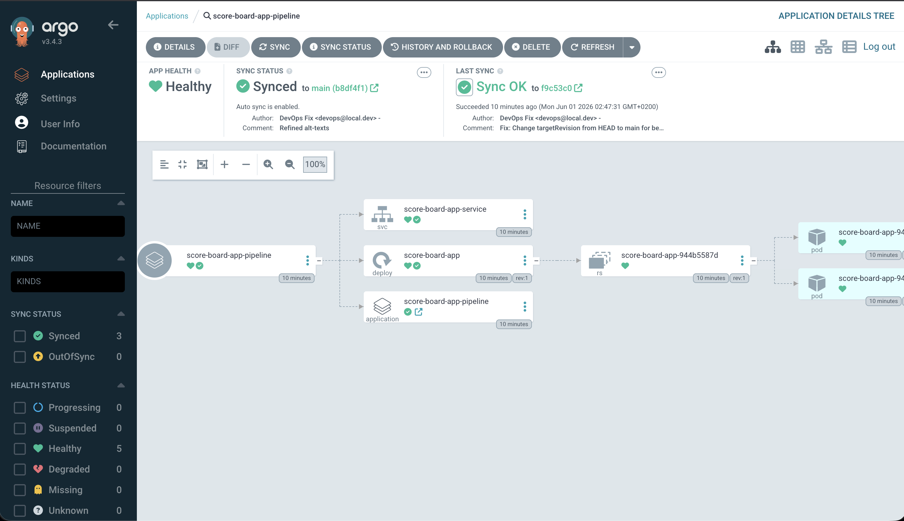
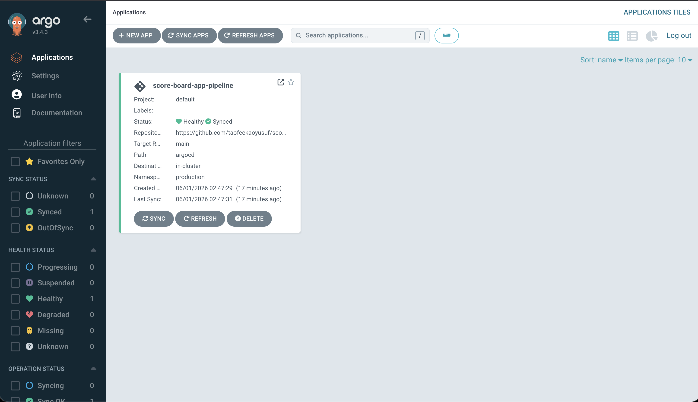

# Automated Enterprise GitOps CI/CD Pipeline with SonarQube Cloud, Jenkins & Argo CD

This is the complimentary repository for the deployment of the [Score Board Application](https://github.com/taofeekaoyusuf/score-board-app.git) showcasing a complete modern GitOps software delivery pipeline. Source code changes trigger an automated build and security checking workflow, culminating in automated, zero-touch Kubernetes deployments via declarative desired-state configuration syncing.

## SCOREBOARD APPLICATION

#### This is an application to record the scores of any game being played by two Opponents.

## Architecture Flow

1. Jenkins dynamically edits the Kubernetes manifest repository (`gitops-repo`), tracking the precise application version tag.
2. **Argo CD** identifies a delta between the live cluster state and git desired state, initiating an automated rolling sync into the Kubernetes Cluster.

## Tech Stack Used

* **Declarative GitOps Engine**: Argo CD
* **Target Runtime Platform**: Kubernetes

## Prerequisites & Dependencies

To execute this architecture locally or on a cloud platform, verify the installation of:
* **Docker Engine** (v20.10+)
* **Minikube** or **Kind** (Kubernetes Cluster v1.26+)
* **Jenkins Server** with standard plugins installed:
  * SonarQube Scanner
  * Pipeline: Stage View
  * Docker Pipeline
  * Credentials Binding
* **Argo CD** installed on your cluster:
  - kubectl create namespace argocd
  - kubectl apply -n argocd -f [https://raw.githubusercontent.com/argoproj/argo-cd/stable/manifests/install.yaml](https://raw.githubusercontent.com/argoproj/argo-cd/stable/manifests/install.yaml)
  - To port-forward ArgoCD Server for access, do:
  `kubectl port-forward svc/argocd-server -n argocd 8089:443 &`
  - You can then acceess it at: `https://localhost:8089`
  - To login to the ArgoCD UI:
      Username: admin
      Password: Run this command to get the Password: `kubectl -n argocd get secret argocd-initial-admin-secret -o jsonpath="{.data.password}" | base64 -d && echo`
  - ArgoCD login Interface:
  
  - After login into ArgoCD, you will be met with the deployed Application, thus:
  

The complimentary GitOps Repository can found [here](https://github.com/taofeekaoyusuf/score-board-gitops)

To access and play with the Score Board Application, go to `127.0.0.1:80` or `http://localhost:80`

This application can be forked and modified as pleased for more robustness.
@Copyright: TAOY